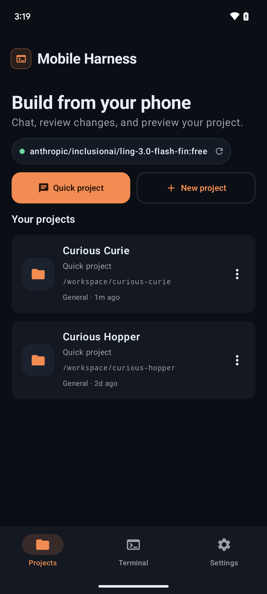
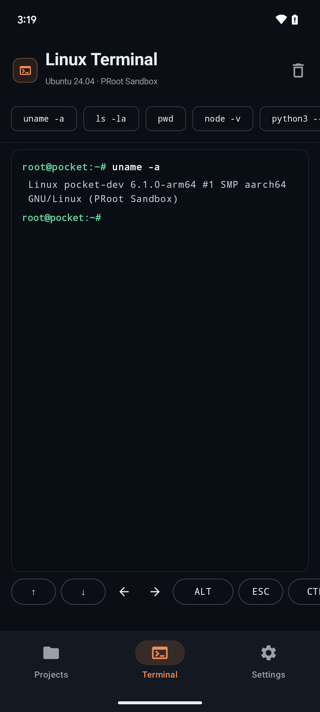
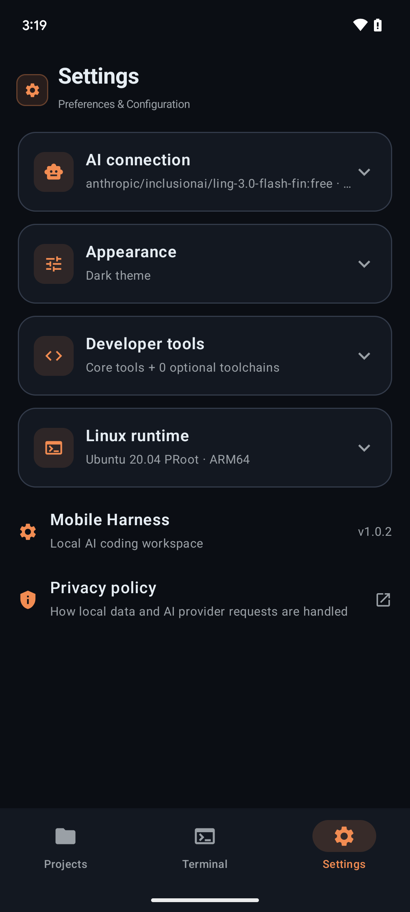
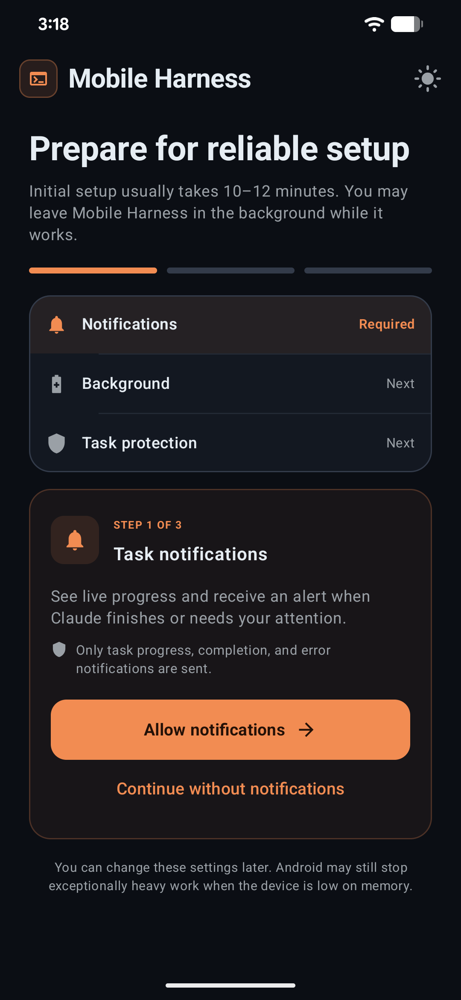
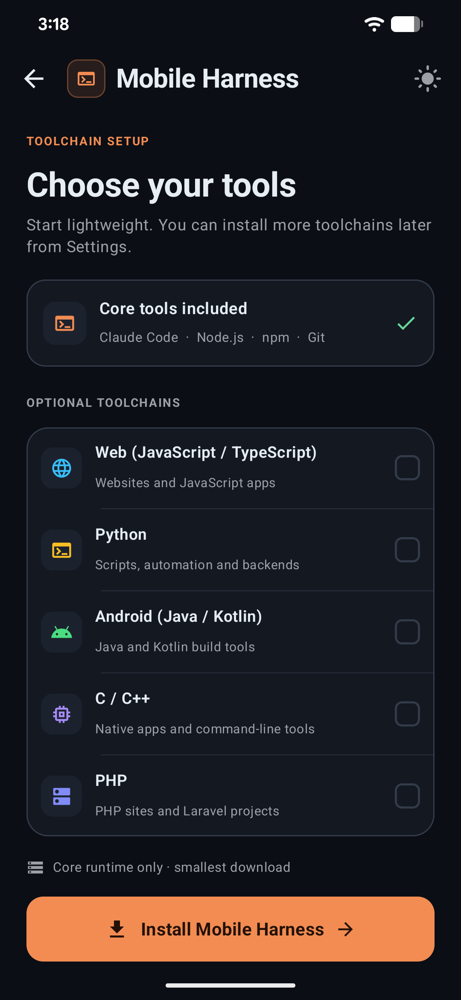
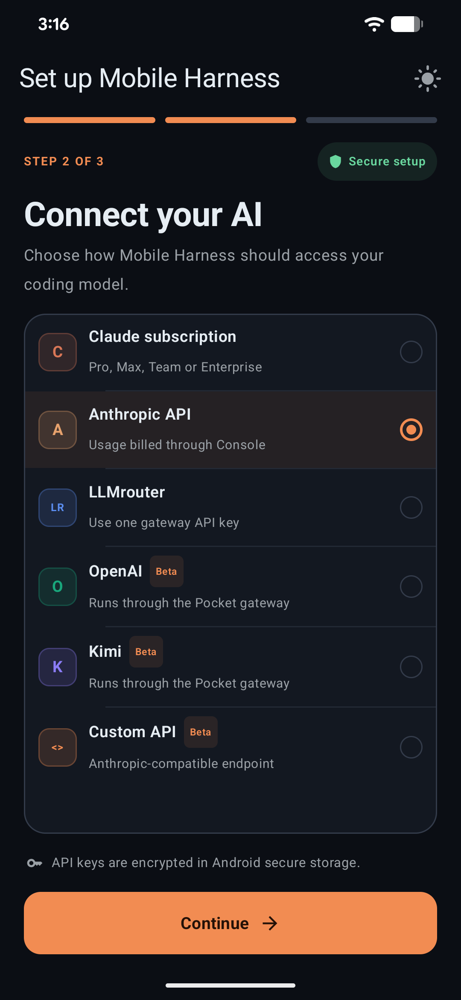
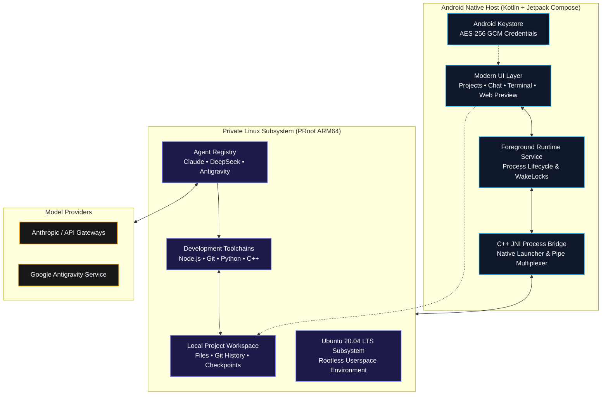

# OVE Claue
Developed by Open Vision Engineering

<div align="center">

  

  # OVE Claue

  ### *The complete autonomous AI development workspace for Android.*

  **Chat with coding agents, edit projects, execute real Linux commands, and preview live web servers — all directly on your phone.**

  <br />

  [](https://github.com/techexample/OVE-Claue/releases/tag/v1.0.4)
  [](#system-requirements)
  [](#system-requirements)
  [](LICENSE)
  [](https://www.youtube.com/techexample)

  <br />

  [**Download Online APK**](https://github.com/techexample/OVE-Claue/releases/download/v1.0.4/mobile-harness-online-v1.0.4.apk) &nbsp;•&nbsp;
  [**Download Offline APK**](https://github.com/techexample/OVE-Claue/releases/download/v1.0.4/mobile-harness-offline-v1.0.4.apk) &nbsp;•&nbsp;
  [**Watch Walkthrough (3 min)**](https://youtu.be/QzAau52Z7yQ) &nbsp;•&nbsp;
  [**Quickstart Guide**](#quickstart) &nbsp;•&nbsp;
  [**Architecture**](#architecture) &nbsp;•&nbsp;
  [**Build from Source**](#developer-guides)

</div>

<br />

---

<p align="center">
  <a href="https://youtu.be/QzAau52Z7yQ" target="_blank" rel="noopener noreferrer">
    
  </a>
  <br />
  <sub>Watch the product walkthrough and demo &nbsp;|&nbsp; <i>Setting up Ubuntu, connecting Claude Code, and building an app on Android</i></sub>
</p>

---

<br />

> [!IMPORTANT]
> **Environment Security Notice**  
> OVE Claue runs on **ARM64 Android devices** using a private userspace PRoot layer. While isolated from other apps via standard Android sandbox permissions, PRoot is not a virtualization boundary or hardened security jail. Only execute projects and dependencies you own or trust.

<br />

## Download OVE Claue

<div align="center">
  <h3>Choose the edition that fits your setup</h3>
  <p>Both editions contain the complete OVE Claue app and support secure in-app updates beginning with v1.0.3.</p>
</div>

<table>
  <tr>
    <td width="50%" valign="top" align="center">
      <h3>Online Edition</h3>
      <p><strong>87.4 MB · Recommended</strong></p>
      <p>Start with the smaller APK. Core, Python, and Android runtime bundles are downloaded only when needed.</p>
      <a href="https://github.com/techexample/OVE-Claue/releases/download/v1.0.4/mobile-harness-online-v1.0.4.apk">
        
      </a>
    </td>
    <td width="50%" valign="top" align="center">
      <h3>Offline Edition</h3>
      <p><strong>887.7 MB · Everything included</strong></p>
      <p>Includes the Core, Python, and Android runtime bundles for setup with limited or unavailable internet.</p>
      <a href="https://github.com/techexample/OVE-Claue/releases/download/v1.0.4/mobile-harness-offline-v1.0.4.apk">
        
      </a>
    </td>
  </tr>
</table>

<p align="center">
  <strong>ARM64 Android 9+</strong><br />
  <sub>Direct APK installation · No root required · No USB or wireless ADB pairing</sub>
</p>

<br />

## Capabilities

OVE Claue unites modern **Jetpack Compose UI** with a self-contained **Ubuntu 20.04 LTS subsystem**. It gives you a desktop-class software development environment in your pocket without requiring root access, unlocked bootloaders, or external applications like Termux.

<table>
  <tr>
    <td width="50%" valign="top">
      <h3>Autonomous Agent Coding</h3>
      <p>Native integrations with Claude Code, DeepSeek Harness, and Antigravity CLI. Each agent has an isolated driver, settings, and resumable project conversations.</p>
    </td>
    <td width="50%" valign="top">
      <h3>Isolated Linux Subsystem</h3>
      <p>A full Ubuntu 20.04 ARM64 userspace running inside PRoot. Includes Node.js, npm, Git, OpenSSL, and essential shell tooling out of the box.</p>
    </td>
  </tr>
  <tr>
    <td width="50%" valign="top">
      <h3>Instant Web Preview</h3>
      <p>Spun up a Vite, Next.js, or Express server? Test web interfaces in real-time within a restricted, sandboxed mobile WebView with console telemetry.</p>
    </td>
    <td width="50%" valign="top">
      <h3>Keystore-Grade Encryption</h3>
      <p>Your API keys and credentials are encrypted using Android Keystore-backed AES-256 GCM. No telemetry, no remote proxies, and zero plain-text leaks.</p>
    </td>
  </tr>
  <tr>
    <td width="50%" valign="top">
      <h3>Persistent Project Sessions</h3>
      <p>Keep projects, chat history, files, and task context together so work can continue across app sessions.</p>
    </td>
    <td width="50%" valign="top">
      <h3>Native File Workflow</h3>
      <p>Browse, edit, search, and attach files directly from the app interface. Interoperate with system storage via Android Storage Access Framework (SAF).</p>
    </td>
  </tr>
  <tr>
    <td width="50%" valign="top">
      <h3>On-device Android Builds</h3>
      <p>Build, install, and launch Android APKs directly on the phone without USB or wireless ADB pairing.</p>
    </td>
    <td width="50%" valign="top">
      <h3>Optional Toolchains</h3>
      <p>Add Python, Android, C/C++, and PHP tooling only when a project needs it.</p>
    </td>
  </tr>
</table>

<br />

## Workspace Interface

<table>
  <tr>
    <th width="33%" align="center">Projects</th>
    <th width="33%" align="center">Terminal</th>
    <th width="33%" align="center">Settings</th>
  </tr>
  <tr>
    <td align="center" valign="top">
      
    </td>
    <td align="center" valign="top">
      
    </td>
    <td align="center" valign="top">
      
    </td>
  </tr>
  <tr>
    <td align="center"><sub>Create, organize, and resume isolated workspace sessions.</sub></td>
    <td align="center"><sub>Execute real Linux commands and scripts with instant output.</sub></td>
    <td align="center"><sub>Manage AI providers, installed toolchains, themes, and runtime health.</sub></td>
  </tr>
</table>

<br />

## Quickstart

Get up and running in 3 guided steps:

### 1. Download & Install
Download the latest signed release APK from [GitHub Releases](https://github.com/techexample/OVE-Claue/releases/latest).

```text
Target Architecture : ARM64 (arm64-v8a)
Package Version     : v1.0.4
Minimum OS Level    : Android 9.0 (API 28)
```

### 2. Guided Bootstrap (~10 Minutes)
Launch the application and follow the interactive setup wizard:

<table>
  <tr>
    <th width="33%" align="center">1 · System Readiness</th>
    <th width="33%" align="center">2 · Toolchains</th>
    <th width="33%" align="center">3 · AI Provider</th>
  </tr>
  <tr>
    <td align="center" valign="top">
      
    </td>
    <td align="center" valign="top">
      
    </td>
    <td align="center" valign="top">
      
    </td>
  </tr>
  <tr>
    <td align="center"><sub>Verifies device storage, CPU architecture, and background service permissions.</sub></td>
    <td align="center"><sub>Select core Ubuntu runtime and optional development stacks.</sub></td>
    <td align="center"><sub>Securely store your API keys in Android Keystore.</sub></td>
  </tr>
</table>

### 3. Create & Build
1. Tap **New Project** or launch an instant **Quick Project**.
2. Open the **AI Workspace** and describe what you want to build.
3. Watch the agent inspect files, draft code, run builds, and launch local web previews.

<br />

## Model Providers

OVE Claue uses Claude Code's Anthropic-compatible API protocol. You can connect official endpoints or route requests through compatible translation proxies:

| Provider | Integration Type | Streaming | Tool Calling | Status | Notes |
| :--- | :---: | :---: | :---: | :---: | :--- |
| **Anthropic API** | Direct Key | Supported | Supported | `Recommended` | Primary supported backend |
| **OpenRouter** | Gateway | Supported | Supported | `Supported` | Routes compatible models through one API key |
| **DeepSeek** | Direct Key | Supported | Supported | `Supported` | Anthropic-compatible endpoint |
| **Kimi** | Direct Key | Supported | Supported | `Supported` | Anthropic-compatible Moonshot endpoint |
| **Custom API** | Endpoint Override | Compatible | Compatible | `Experimental` | User-configured gateway |

> [!NOTE]
> API keys are stored with hardware-backed Android Keystore AES-256-GCM encryption. Antigravity Google OAuth credentials are created and retained only by the official `agy` CLI in its persistent Linux home; OVE Claue never reads or copies its tokens.

### Coding agents

| Agent | Authentication | Installation | Isolation |
| :--- | :--- | :--- | :--- |
| **Claude Code** | Claude account or API-key providers | Included in Core | Existing Claude bridge and settings |
| **DeepSeek Harness** | API-key providers | On demand | Existing DSH bridge and settings |
| **Antigravity CLI** | Official Google OAuth flow | Version-pinned online download | Dedicated `agy` bridge, model, effort, and conversation IDs |

For Antigravity, select **Antigravity CLI**, install it, and tap **Sign in with Google**. OVE Claue starts the official CLI login, opens the freshly generated Google URL in the system browser, and sends the returned one-time code back to that waiting process. The app does not embed Google login in a WebView and does not construct its own OAuth request.

> [!WARNING]
> Antigravity tasks currently launch with `--dangerously-skip-permissions`. This gives the official agent permission to run tools without individual PocketDev approval prompts. Use it only with projects and prompts you trust. Account quotas and service limits still apply; signing in does not provide unlimited usage.

When Android is selected during onboarding, OVE Claue installs that complete toolchain into its private Ubuntu environment. Android projects can then be built with the workspace play button. The resulting debug APK is passed directly to Android's system package installer and launched after installation; USB debugging, wireless debugging, an ADB port, and a pairing code are not required. Android still requires the user to allow installs from OVE Claue and confirm each installation.

<br />

## Architecture

OVE Claue bridges native Android Jetpack Compose to an isolated PRoot Linux execution layer via an optimized C++ JNI bridge:



### Core Runtime Components
* **Base Environment**: Ubuntu 20.04 ARM64 verified rootfs
* **Agent Engine**: Registry-selected, isolated drivers for Claude Code, DeepSeek Harness, and the official Antigravity CLI
* **Native Tooling**: Node.js LTS, npm, Git, OpenSSL, curl, and GNU coreutils
* **Process Virtualization**: PRoot user-space architecture emulation with zero kernel modifications

<br />

## System Requirements

| Metric | Minimum Specification | Recommended Specification |
| :--- | :--- | :--- |
| **Operating System** | Android 9.0 (API level 28) | Android 13.0+ (API level 33+) |
| **CPU Architecture** | 64-bit ARM (`arm64-v8a`) | High-performance 8-Core ARM64 (Snapdragon 8 Gen 1+ / Dimensity) |
| **RAM** | 4 GB | 8 GB or more |
| **Free Storage** | 2.5 GB (Base Runtime) | 8.0 GB+ (For multi-language toolchains and build caches) |
| **Network** | Stable connection for setup & API | High-speed Wi-Fi during initial rootfs provisioning |

<br />

---

## Developer Guides

<details>
<summary><b>Building from source (Android Studio & NDK)</b></summary>

<br />

### Prerequisites
* **Android Studio**: Ladybug / Hedgehog or newer
* **Android SDK**: API Level 36 (`compileSdk 36`)
* **Java Development Kit**: JDK 17 (Eclipse Temurin or OpenJDK)
* **Android NDK**: `26.1.10909125`
* **CMake**: `3.22.1`

### Clone & Build Debug APK
```bash
# Clone the repository
git clone https://github.com/techexample/OVE-Claue.git
cd OVE-Claue

# Build the standard ARM64 debug binary
./gradlew assembleDebug

# Deploy directly to a connected test device
adb install -r app/build/outputs/apk/debug/app-debug.apk
```

### Quality Assurance & Testing
```bash
# Run unit tests
./gradlew testDebugUnitTest

# Run static analysis linter
./gradlew lintDebug
```

### Target Profiles
* **Direct Sideload APK** (Default): Targets API 28 to preserve proven userspace execution paths under Android 10-14.
* **Google Play Compliance Build**:
  ```bash
  ./gradlew -PplayBuild=true assembleDebug
  ```
  Refer to the [Google Play Release Checklist](docs/PLAY_STORE_CHECKLIST.md) for signing and permission policies.

</details>

<details>
<summary><b>Optional toolchains and development stacks</b></summary>

<br />

OVE Claue allows downloading optional developer packs on demand to conserve space:

* **Python Suite**: Python 3.10+, pip, virtualenv, and essential scientific C-extensions.
* **Android & JVM**: OpenJDK 17 headless runtime and Gradle build tools.
* **C / C++ Compiler Suite**: GCC/G++, Clang, Make, and CMake for native tool compilation.
* **PHP Development**: PHP CLI runtime, Composer, and standard database extensions.

> *Note: Kernel-level virtualization technologies such as Docker, KVM, systemd services, and nested hardware emulators are not supported under PRoot.*

</details>

<details>
<summary><b>Repository directory structure</b></summary>

<br />

```text
OVE-Claue/
├── app/src/main/
│   ├── java/com/oveclaue/app/
│   │   ├── data/       # Preferences, Keystore AES encryption, SQLite persistence
│   │   ├── model/      # Data entities: Projects, Chats, Files, Tool calls
│   │   ├── runtime/    # PRoot installer, C++ agent bridge, foreground services
│   │   └── ui/         # Jetpack Compose screens, Material 3 theme, ViewModels
│   ├── cpp/            # Native C++ launcher, pseudo-terminal pipe handler
│   ├── assets/         # Verified rootfs checksums, licenses, base configuration
│   └── res/            # Android icons, XML drawables, vector assets
├── fastlane/           # Play Store metadata, graphics, and release automation
└── docs/               # In-depth architectural notes & Play Store review guides
```

</details>

<details>
<summary><b>Security model and data privacy</b></summary>

<br />

* **Zero Cloud Intermediaries**: OVE Claue connects your device directly to your chosen AI endpoint. No intermediate relays or telemetry servers collect your prompts or code.
* **Scoped Storage**: Project imports and exports utilize Android's official Storage Access Framework (SAF) instead of broad shared storage access.
* **Cryptographic Checksums**: Root filesystem archives and Claude Code CLI packages are verified via SHA-256 checksums prior to extraction.
* **Encrypted Secrets**: API tokens are encrypted in hardware-backed storage via Android Keystore.

- ARM64 phones only
- No hardened isolation for hostile code
- Terminal input/output currently uses a process bridge rather than a complete PTY emulator; full-screen interactive programs may render incorrectly
- Background tasks are subject to Android process and battery policies
- Custom providers may lack Claude-compatible thinking, tool use, token counting, or streaming behavior
- Large builds can be slow and memory-intensive under PRoot
- Runtime installation requires a substantial download and free storage
- Project-specific Android libraries may still be downloaded by Gradle when they are not already in the bundled Maven cache

Read our complete [Privacy Policy](PRIVACY.md).

</details>

OVE Claue is currently intended for signed direct APK distribution and private testing. Its Android-project workflow requests permission to submit user-built APKs to Android's package installer, which requires a dedicated Google Play policy declaration and approval if distributed through Play.

<br />

## Current Limitations

* **Architecture**: Exclusively supports 64-bit ARM (`arm64-v8a`) hardware.
* **Process Isolation**: PRoot maps file systems and IDs in user space; it is not a cryptographically hardened container or VM.
* **Terminal Emulation**: The process bridge handles standard CLI workflows and REPLs; specialized ncurses applications may experience minor layout artifacts.
* **OS Process Management**: Heavy compilation workloads may be throttled if Android applies aggressive battery optimization. It is recommended to exempt OVE Claue from battery optimization in device settings.

<br />

## Legal & Trademarks

* OVE Claue is an independent open-source project and is not affiliated with, endorsed by, or sponsored by Anthropic.
* **Claude** and **Claude Code** are trademarks of Anthropic, PBC. Claude Code CLI is downloaded directly from Anthropic's official distribution endpoints during setup and remains governed by Anthropic's license terms.
* Ubuntu, Android, Kotlin, Node.js, Git, and other registered trademarks belong to their respective copyright holders.
* Third-party open-source licenses are compiled in [`app/src/main/assets/licenses`](app/src/main/assets/licenses).

<br />

## License

This project is licensed under the [MIT License](LICENSE). Third-party runtime binaries and packages remain governed by their respective upstream licenses.

<br />

---

<div align="center">
  <sub>Crafted for developers who want a serious, uncompromised development environment wherever they go.</sub>
  <br />
  <sub>Copyright © 2026 Tech Example. All rights reserved.</sub>
</div>
